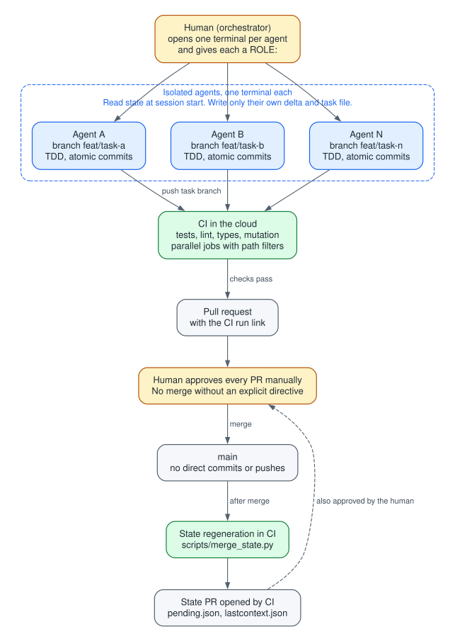
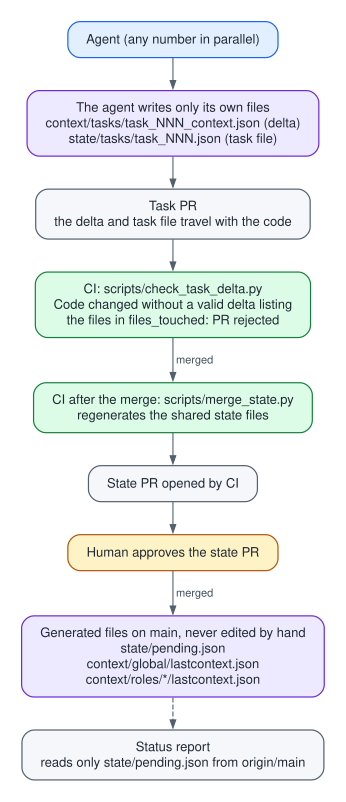
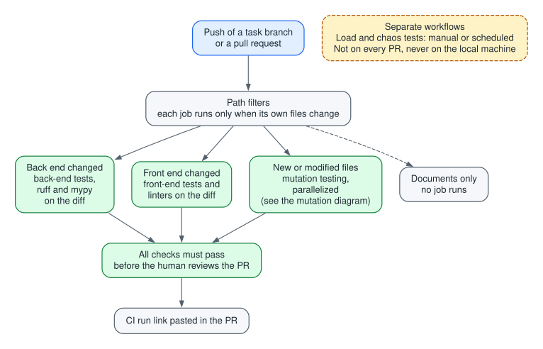
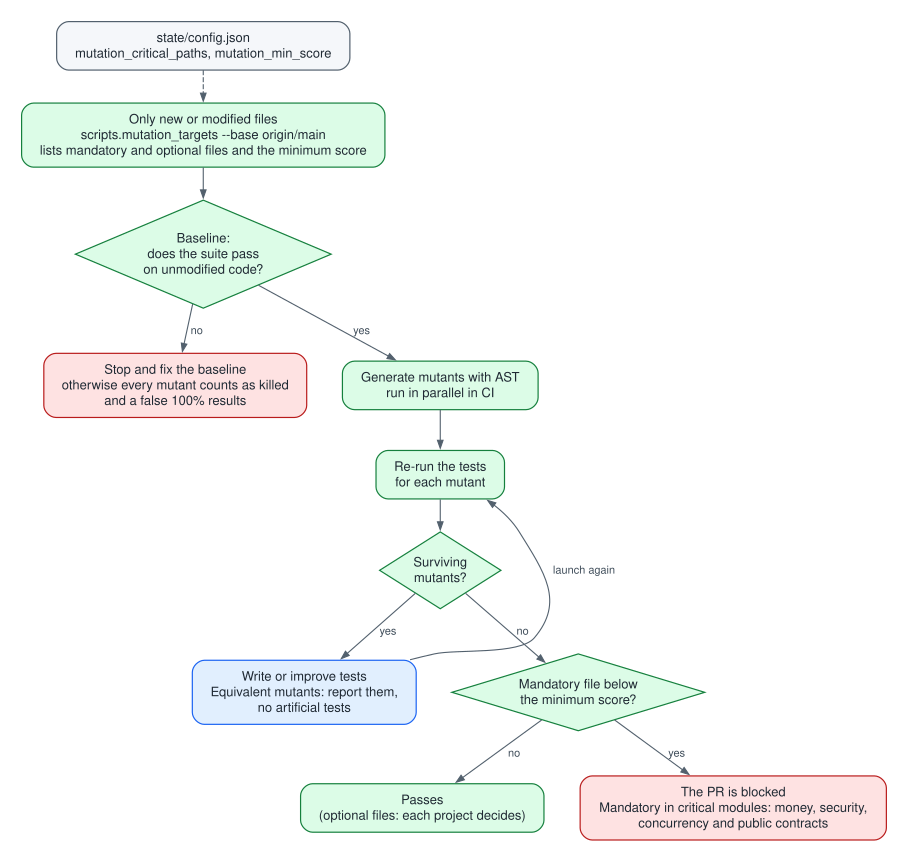
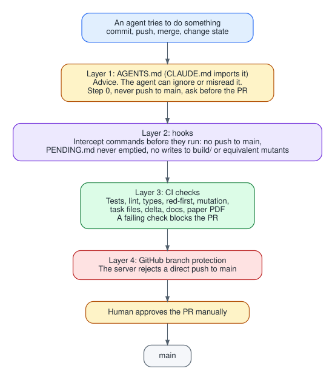
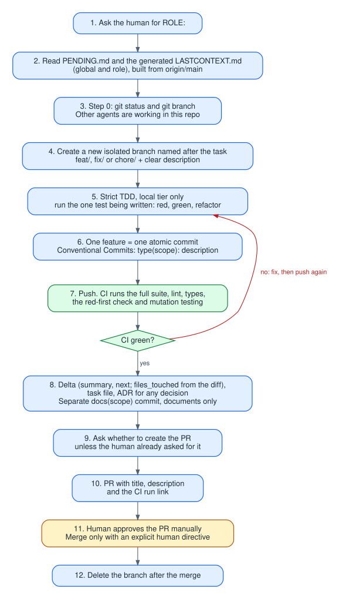

# AFAW (Anti-Fragile Agentic Workflow)

**A deterministic, multi-agent methodology for AI-assisted software development.**

Moving from a single AI assistant in your IDE to several autonomous agents working on the same repository tends to create operational chaos: branch collisions, tests that pass by accident (vacuous tests), overwritten context and hallucinated results.

AFAW is a methodological framework and a repository-level boilerplate for governing that chaos. It lets several agents write code in parallel while constraining them with deterministic validation gates.

*Reference rules target a Python backend and can be adapted to other stacks.*

## Core principle: "The AI decides, the engine measures"

Probabilistic models (LLMs) are not sources of truth. In AFAW the AI proposes and writes code, but its own assessment is never trusted. Every metric (tests, types, coverage, mutation score) comes from deterministic tools run in CI.

## Pillars

- **Strict per-task isolation:** one agent, one task, one isolated branch, in its own terminal. The rule is that agents do not work on `main` and do not share a working directory.
- **State as code:** global and per-role context is stored in versioned `.json` files. Each agent writes only its own delta and its task file; CI regenerates the shared state after each merge to avoid conflicts.
- **Strict TDD:** the failing test comes first, then the minimum code. A bug starts with a test that reproduces it.
- **Deterministic verification in CI:** nothing heavy runs on the local machine. Tests, type checks and linters run in parallel in the cloud, with path filters. With branch protection and required checks, a failing CI blocks the PR.
- **Mutation testing on the diff:** to stop the AI from writing complacent tests that pass without checking anything, the engine injects mutations only into modified files. In critical modules (money, security, concurrency, public contracts), a file below the minimum score blocks the PR; elsewhere it is optional and each project decides.
- **Human authority:** the agent creates branches, writes code and proposes Pull Requests. A human approves every PR and decides every merge. These rules are also enforced outside the prompt (branch protection, hooks and CI), because prompt instructions are advice, not guarantees.

## Who it is for

Engineers and teams that want to scale development with several AI agents (Claude Code, Cursor, etc.) with greater verifiability and traceability.

## Scope and limits

The reference rules assume a Python backend; other stacks need adaptation. AFAW has not been validated in a controlled study and makes no claim about speed, cost or defect-rate improvements.



*Colors in all diagrams: blue = agent action, amber = human, green = CI or deterministic check, purple = state files, red = blocked.*

## The problem it addresses

Working with several agents on one repo tends to fail in predictable ways:

- Agents start coding on whatever branch is checked out and collide with each other.
- Two agents update the same shared context file (`LASTCONTEXT`, `PENDING`) and produce merge conflicts.
- Agents claim results they never measured, or write tests that pass no matter what.
- Heavy test suites run on the local machine and block the workflow.
- Nothing prevents a push to `main`.

These rules come from real mistakes observed while working with agents.

## How it works

**1. Isolated state per task.**
Agents never edit shared state files. Each agent writes only its own delta (`context/tasks/task_NNN_context.json`) and its task file (`state/tasks/task_NNN.json`). `state/pending.json` and the global/role `lastcontext.json` files are regenerated by CI (`scripts/merge_state.py`), which opens a PR for human approval. CI rejects code changes that come without a valid delta (`scripts/check_task_delta.py`).



**2. One task, one branch, atomic commits.**
Before touching any file the agent checks `git status` and `git branch` and creates a new branch named after the task. Conventional Commits, one feature per commit, documentation in its own commit.

**3. Strict TDD.**
Test first, confirm it fails, then write the minimum code. Bugs start with a failing reproduction test.

**4. Validation runs in CI, in parallel.**
Tests, linters, type checks and builds run in the cloud with path filters, so each job runs only when its files change. Document-only changes trigger nothing.



**5. Mutation testing on the diff.**
Modified files are mutated (AST-based) and the suite is re-run. Surviving mutants are fixed by improving tests. The baseline must pass before mutating, and equivalent mutants are reported instead of covered with artificial tests. It is mandatory in critical modules (money, security, concurrency, public contracts); which paths and what minimum score are defined per project in `state/config.json`.



**6. Human in the loop.**
No commits or pushes to `main`, no merges without an explicit human directive, and the human approves every PR. These rules should also be enforced outside the prompt (GitHub branch protection and hooks), since prompt instructions alone are advice, not guarantees.



**7. Roles.**
At session start the agent asks for its `ROL:` and reads that role's `LASTCONTEXT` (or the global one if none exists).

## How to use it

1. Create your repo from this template (GitHub → **Use this template**) or clone it and re-initialize git.
2. Set project-specific values in `state/config.json` (code folders, `mutation_critical_paths`, `mutation_min_score`).
3. Enable branch protection on `main` and require the CI checks.
4. Open one terminal per agent, each one isolated. Start the agent and answer its first question with a `ROL:`.
5. The agent creates its branch, works task by task with TDD, pushes, and reads the CI result.
6. It writes its delta and task file, and asks before opening a PR.
7. You review and approve. CI regenerates the shared state through its own PR.
8. Ask for status at any time: the agent reads only `state/pending.json` from `origin/main` and answers with a table (task, status, difficulty, priority).

### The life of a task



## Repository layout (reference)

- `AGENTS.md` / `CLAUDE.md`: agent rules (keep them identical, or make one a symlink)
- `state/`: `pending.json`, `config.json`, `tasks/task_NNN.json`
- `context/`: `global/`, `roles/*/`, `tasks/task_NNN_context.json`
- `scripts/`: `merge_state.py`, `check_task_delta.py`, `mutation_targets.py`, `build_diagrams.mjs`
- `.github/workflows/`: CI with path filters and parallel jobs
- `docs/diagrams/`: Graphviz sources of the diagrams above (`.dot`)
- `docs/img/`: rendered diagrams (`.svg` for this README, `.png` for places that do not show SVG)

## Scope and limits

- The rules assume a Python backend (async, `pytest`, `mypy --strict`, Postgres, Terraform). For other stacks, adapt sections 4, 5, 8 and 16.
- Mutation score measures how well the tests detect changes, not whether the code meets business requirements.
- CI minutes are limited on private repositories.
- No performance figures are claimed here; measure your own (time per task, tokens spent, broken tests, escaped bugs) and add them.

## Rebuilding the diagrams

The diagrams are generated from the `.dot` files. To change one, edit its source and run:

```bash
npm install
node scripts/build_diagrams.mjs
```

This rewrites `docs/img/*.svg` and `docs/img/*.png`.

## Author

Agustin Diaz-Cano, MS Candidate, Information Systems Engineering (UTN)

## License

MIT (or Apache-2.0 if you want an explicit patent grant).
