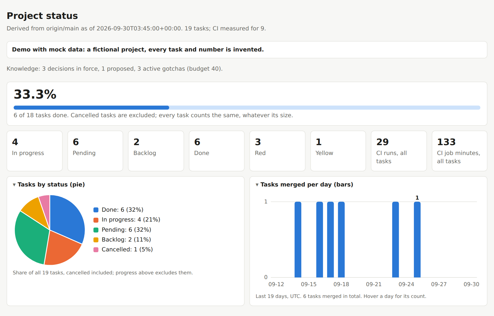
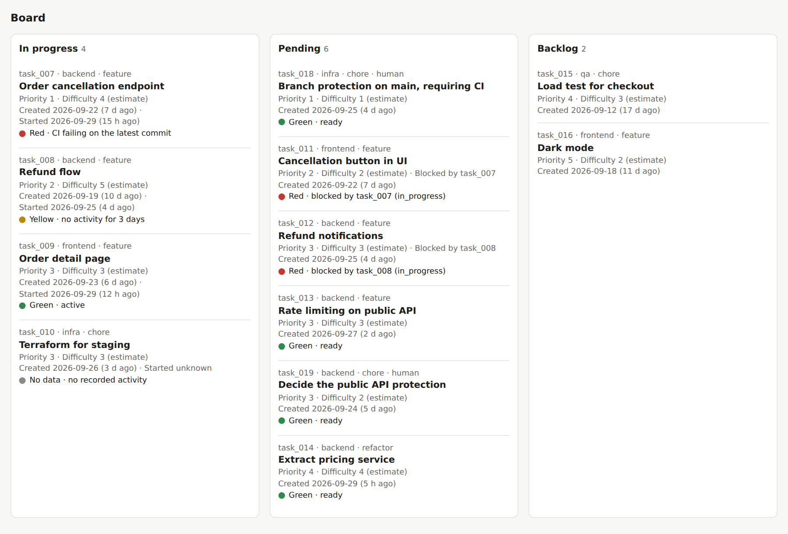
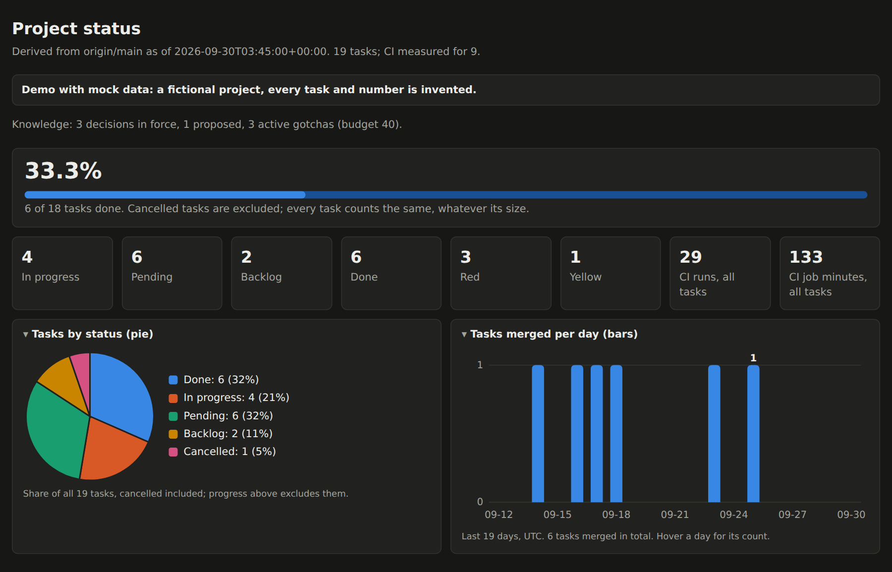

# AFAW (Anti-Fragile Agentic Workflow)

**A deterministic, multi-agent methodology for AI-assisted software development.**

Several coding agents working on one repository fail in predictable ways: they collide on branches and on shared context files, claim results they never measured, and write tests that pass whatever the code does. AFAW is a repository-level method and boilerplate that lets agents write code in parallel while deterministic tools decide whether the result is acceptable and a human approves every merge.

*The reference implementation targets a Python backend; the stack-specific rules are meant to be adapted.*

**White paper (PDF): [`docs/paper/afaw.pdf`](docs/paper/afaw.pdf)** · LaTeX source: [`docs/paper/afaw.tex`](docs/paper/afaw.tex) · DOI [10.5281/zenodo.23050310](https://doi.org/10.5281/zenodo.23050310)

**Live demo: [agustindiazcano.github.io/afaw-anti-fragile-agentic-workflow](https://agustindiazcano.github.io/afaw-anti-fragile-agentic-workflow/)** · this repository's own dashboard: [`/live/`](https://agustindiazcano.github.io/afaw-anti-fragile-agentic-workflow/live/)

---

## Demo dashboard

A dashboard built by `scripts/build_state.py` from mock data: a fictional project whose every task and number is invented ([`examples/mock_dashboard.py`](examples/mock_dashboard.py)). It shows each traffic-light rule firing: CI failing, a blocker not done, no activity for three days, nothing measured.





<details>
<summary>Dark mode</summary>



</details>

Build it locally: `python -m examples.mock_dashboard mock-output` and open `mock-output/index.html`.

---

## Index

1. [Demo dashboard](#demo-dashboard)
2. [Core principle](#core-principle-the-ai-decides-the-engine-measures)
3. [Failure modes and mechanisms](#failure-modes-and-mechanisms)
4. [System overview](#system-overview)
5. [How it works](#how-it-works)
6. [The life of a task](#the-life-of-a-task)
7. [Directory structure](#directory-structure)
8. [Getting started](#getting-started)
9. [Daily workflow](#daily-workflow)
10. [Scope and limits](#scope-and-limits)
11. [Rebuilding the diagrams and the paper](#rebuilding-the-diagrams-and-the-paper)
12. [Citation, author, license](#citation)

---

## Core principle: "The AI decides, the engine measures"

A model proposes and writes code; its own assessment is never trusted. Every number (tests, types, coverage, mutation score, task timings, the traffic light) comes from a deterministic tool, and a value an agent could have made up is rejected where it would be declared.

## Failure modes and mechanisms

| Failure | Mechanism | What remains |
|---|---|---|
| Wrong-branch work | Step 0 (`git status`, `git branch`), one branch per task, one terminal per agent; a hook denies a push to `main` | Agents sharing one working tree can still overwrite uncommitted files |
| Shared-state conflicts | Each task writes only its own files; shared views are derived on demand and never committed | Agents do not see unmerged work on other branches |
| Unmeasured claims | Measured values are rejected in task files; `files_touched` must equal the diff; the red step is verified in CI | A person must still follow the CI link |
| Vacuous tests | Red-first check; mutation testing on the diff; equivalent mutants accepted only by the human | Mutation score is not correctness |
| Heavy local runs | Two tiers: single tests locally, everything else in CI, in parallel | CI queue latency and minutes |
| Unreviewed integration | Hooks, CI checks, branch protection, human approval | Hooks are best-effort |

## System overview


*Colors in all diagrams: blue = agent action, amber = human, green = CI or deterministic check, purple = state files, red = blocked.*

## How it works

### 1. Task files and derived state

An agent writes only two files: its task file `state/tasks/task_NNN.json` (declared values: title, role, type, status, owner, priority, difficulty, dependencies, branch) and its delta `context/tasks/task_NNN_context.json` (`summary`, `next`, `files_touched`). Their shape is defined once, in `state/schemas/`.

Everything shared is **derived, never committed**: `python -m scripts.build_state --ref origin/main` builds the pending view, the history of done tasks, the metrics, the dashboard and the `LASTCONTEXT.md` files into `build/`. Timestamps and CI results are measured from git and the CI API (`python -m scripts.collect_facts`), never declared; the traffic light is a rule:

- 🔴 a task it depends on is not done, or CI fails on the latest commit of its branch
- 🟡 in progress with no commit or CI run for more than `stale_days`
- 🟢 otherwise; "no data" when nothing was measured


### 2. Project knowledge

State says *what*; prose says *why*. Decisions are ADRs in `docs/adr/`, operational traps are gotchas in `docs/gotchas/` (templates in `docs/templates/`). The generated `LASTCONTEXT.md` indexes them with one line each, next to the current state, what waits on the human and the next tasks. A record leaves the index only for an explicit reason (superseded, deprecated, resolved, or **promoted** to a mechanism), never for its age, and a budget tells the human when to prune. See [ADR 0001](docs/adr/0001-record-decisions-as-adrs.md).

### 3. Strict TDD in two tiers

Locally, the agent runs only the test it is writing. CI runs everything else, including the **red-first check** (`python -m scripts.red_check`): each test a pull request adds must fail on the code before the change.


### 4. Mutation testing on the diff

Only new or modified files are mutated. In critical modules a file below the minimum blocks the pull request. The gate is K / (N − E_human): only the human records an equivalent mutant, in `state/equivalent_mutants.json`, bound to the file's hash (`python -m scripts.mutation_gate`). The mutation engine itself is project-specific.


### 5. Human authority

No commits or pushes to `main`, no merge without an explicit human directive, and the human approves every pull request. Rules in `AGENTS.md` are advice, so they are also enforced by hooks, CI and branch protection.


### 6. Dashboard

A static HTML page (no scripts) with progress, tasks by status, tasks merged per day, the board with ages and lights, timing (agent time, review latency, lead time) and CI cost (runs, queue time, job minutes). `.github/workflows/dashboard.yml` rebuilds it on every push to `main`, every hour and on demand, and publishes it on GitHub Pages: the demo at the site root and this repository's own dashboard at `/live/`. A Pages site is public: do not publish the dashboard of a private project.

## The life of a task


## Directory structure

```text
.
├── AGENTS.md                      # The rules: single source for every agent
├── CLAUDE.md                      # Imports AGENTS.md
├── PENDING.md                     # The human's roadmap (hook: never deleted or emptied)
├── .claude/
│   ├── settings.json              # Hook wiring
│   ├── hooks/                     # session_start (builds and injects LASTCONTEXT.md),
│   │                              # safety_guard (deny/ask), lint_check
│   └── skills/                    # commit, ship, tests, push-dev, trash
├── .github/
│   ├── pull_request_template.md
│   └── workflows/
│       ├── checks.yml             # Every PR: task files, delta, red-first, docs, views
│       ├── scripts-ci.yml         # Lint, types, tests (skipped on documents-only PRs)
│       └── dashboard.yml          # Builds and publishes the dashboard
├── state/
│   ├── config.json                # Code folders, mutation settings, dashboard settings
│   ├── schemas/                   # JSON Schemas: task, delta, config, equivalent mutants
│   └── tasks/task_NNN.json        # One file per task (never deleted)
├── context/tasks/                 # One delta per task
├── docs/
│   ├── adr/                       # Architecture decision records
│   ├── gotchas/                   # Operational traps, closed as resolved or promoted
│   ├── templates/                 # ADR and gotcha templates
│   ├── diagrams/ and img/         # Graphviz sources and rendered figures
│   ├── screenshots/               # Screenshots of the demo dashboard
│   └── paper/                     # The white paper: afaw.pdf and its source afaw.tex
├── scripts/
│   ├── afaw_state/                # Model, facts, lights, durations, views, dashboard
│   ├── build_state.py             # Derived views from a git ref
│   ├── collect_facts.py           # Measured facts from git and the GitHub API
│   ├── check_task_files.py        # Lifecycle, declared values only, unique ids
│   ├── check_task_delta.py        # files_touched equals the diff (--write fills it)
│   ├── check_docs.py              # ADRs, gotchas, links
│   ├── red_check.py               # Added tests must fail on the old code
│   ├── mutation_targets.py        # Mandatory and optional files to mutate
│   ├── mutation_gate.py           # Score with human-accepted equivalences only
│   ├── rules_to_tex.py            # The paper's appendix from AGENTS.md
│   └── setup_protection.sh        # Branch protection and required checks
├── examples/mock_dashboard.py     # The demo: dashboard and LASTCONTEXT.md from mock data
├── src/                           # The project's code
└── tests/tooling/                 # Tests of the scripts and hooks
```

`build/` (the derived views) is ignored by git.

## Getting started

GitHub does not copy branch protection, required checks or Pages settings to a repository created from a template.

1. **Use the template**: GitHub → **Use this template**.
2. **Configure** `state/config.json`: code folders, `mutation_critical_paths`, `mutation_min_score`, and the `dashboard` settings.
3. **Protect `main`**: `bash scripts/setup_protection.sh` (needs the `gh` CLI) requires `lint`, `typecheck`, `tests` and `state-and-docs`, and blocks direct pushes.
4. **Dashboard** (public repositories): Settings → Pages → Source: **GitHub Actions**.
5. **Verify**: open a test pull request and check that the workflows run.
6. **Start**: open a terminal per agent and answer the `ROLE:` question.

## Daily workflow

1. One terminal per agent; answer its `ROLE:`. The session-start hook injects the generated `LASTCONTEXT.md` and `PENDING.md`.
2. The agent creates its branch, works with TDD running only its own test, and pushes; CI verifies the rest.
3. At the end it writes `summary` and `next`, fills `files_touched` with `python -m scripts.check_task_delta --base origin/main --write task_NNN`, records any decision as an ADR, and asks before opening the pull request.
4. You review and merge. Nothing else to approve: the views are derived.
5. Ask for status at any time, or open the dashboard.

## Scope and limits

- The reference rules assume a Python backend (async, `pytest`, `mypy --strict`, Postgres, Terraform). Adapt sections 4–10 and 14–16 of `AGENTS.md` for another stack.
- AFAW has not been validated in a controlled study and makes no claim about speed, cost or defect rates. The paper proposes an evaluation protocol; the dashboard's timings and CI cost are the raw material.
- Mutation score measures how sensitive the tests are to changes, not whether the code meets its requirements.
- The red-first check shows that a new test fails on the old code, not that it fails for the right reason.
- Checks verify the ADRs that exist; a decision that was never recorded is left to the reviewer.

## Rebuilding the diagrams and the paper

```bash
for f in docs/diagrams/*.dot; do n=$(basename "$f" .dot); dot -Tsvg "$f" -o "docs/img/$n.svg"; dot -Tpng -Gdpi=200 "$f" -o "docs/img/$n.png"; done
```

The paper: see [`docs/paper/README.md`](docs/paper/README.md). A pull request that changes `afaw.tex`, `AGENTS.md` or `docs/img/` must also commit the rebuilt `docs/paper/afaw.pdf`; CI checks it.

## Citation

**DOI:** [10.5281/zenodo.23050310](https://doi.org/10.5281/zenodo.23050310)

## Author

Agustin Diaz-Cano, MS Candidate, Information Systems Engineering (UTN). ORCID [0009-0001-4336-490X](https://orcid.org/0009-0001-4336-490X).

## License

MIT
